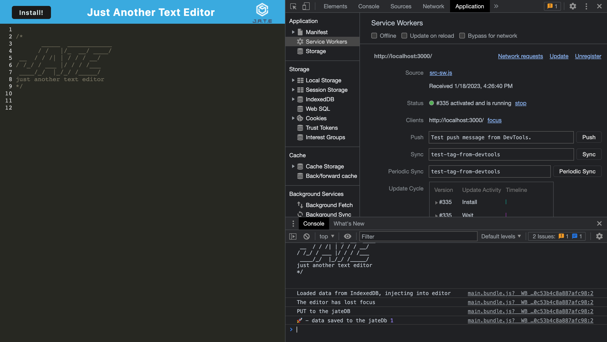
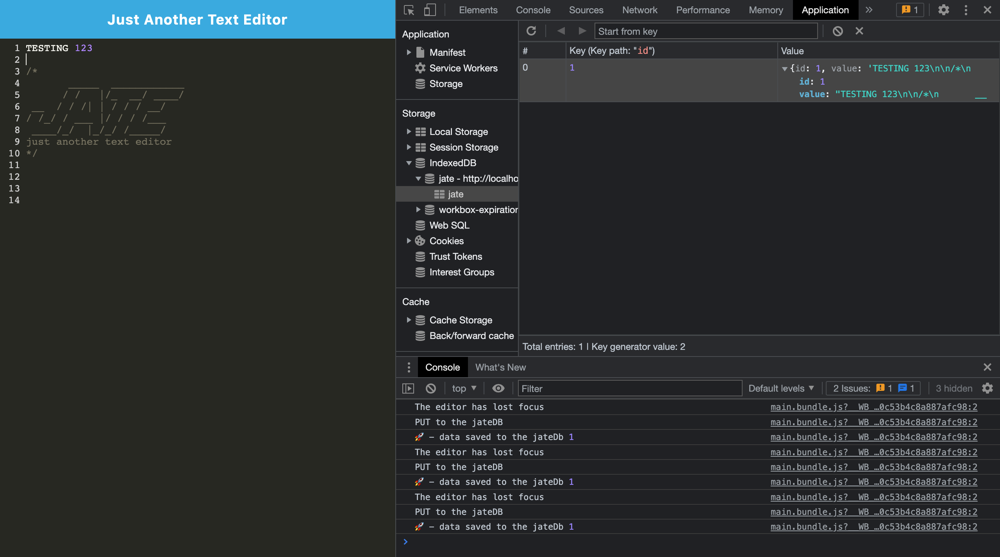
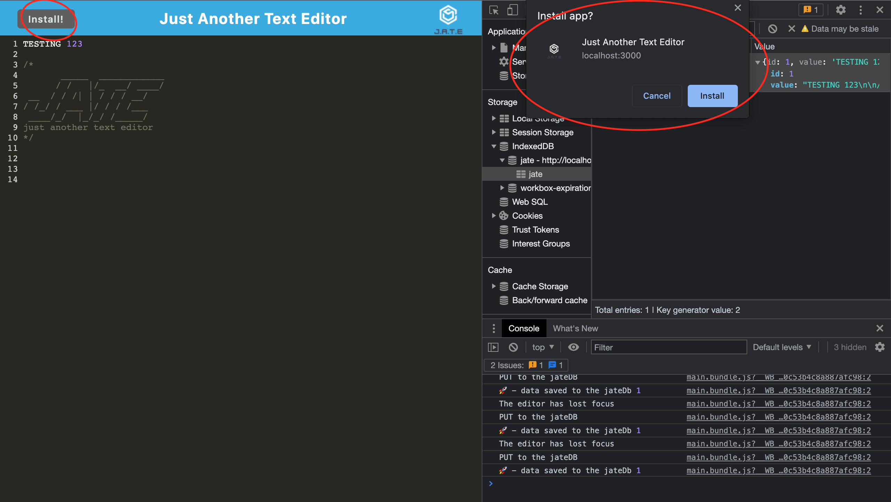

# J.A.T.E. PWA Text Editor

## Description
---
With this JATE text editor we are able to download the JATE text editor web application to your local computers desktop. This text editor can be a useful tool for web developers who like to do work on the go, once JATE is installed on your computer you no longer need an internet connection to use the text editor. This allows web developers to save snippets of code or text safely and without requiring an internet connection.

## Installation
---
To install this project to get the development environment running:

1. Clone GitHub repository here: https://github.com/aHoff6/pwa-text-editor
by clicking the green "code" button and copying the URL.

2. Open the Command Line and change the directory to where you would like to clone the directory.

3. Type the command "git clone" followed by the URL you copied earlier and press enter.

4. After cloning repo open a new terminal and run `npm install` to install dependencies.

5. Then, run `npm run start:dev` to start the local host sever.

6. Go to http://localhost:3000/ in your web browser.

You can also download the JATE web app as an icon on your desktop by clicking the "Install" button on the top left.
This allows you to use the JATE web app without an internet connection.

## Tools Used
---
- PWA
- Express.js
- IndexedDB
- Node.js
- Heroku

## Reference picture
---

## Deployed Link
---
Heroku URL:
https://limitless-springs-84484.herokuapp.com/